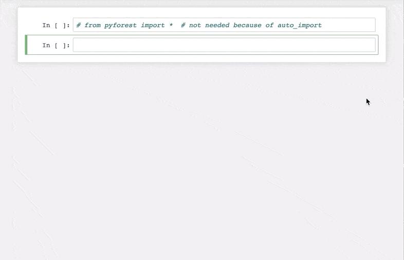
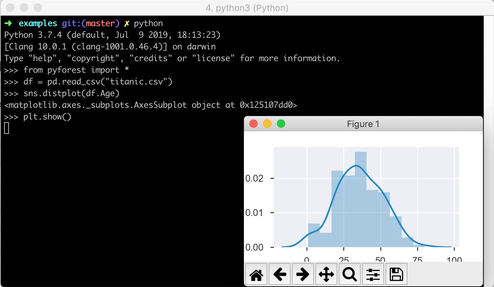

# pyforest - lazy-import of all popular Python Data Science libraries. Stop writing the same imports over and over again.

pyforest lazy-imports all popular Python Data Science libraries so that they are always there when you need them. If you don't use a library, it won't be imported. When you are done with your script, you can export the Python code for the import statements.

- [Demo in Jupyter Notebook](#demo-in-jupyter-notebook)
- [Demo in Python Shell](#demo-in-python-shell)
- [Using pyforest](#using-pyforest)
- [Installation](#installation)
- [FAQs](#frequently-asked-questions)
- [Contributing](#contributing)
- [About](#about)
- [Join our community and grow further](#join-our-community-and-grow-further)

## Demo in Jupyter Notebook

## Demo in Python Shell

## Using pyforest
pyforest lazy-imports all popular Python Data Science libraries with a single line of code:

`from pyforest import *`

And if you use Jupyter or IPython, you can even skip this line because pyforest adds itself to the autostart.

When you are done with your script, you can export all import statements via:
`active_imports()`

Which libraries are available?
- We aim to add all popular Python Data Science libraries which should account for >99% of your daily imports. For example, `pd` from `pandas`, `np` from `numpy`, `sns` from `seaborn`, `plt` from `matplotlib.pyplot`, or `OneHotEncoder` from `sklearn` and many more. In addition, there are also helper modules like `os`, `re`, `tqdm`, or `Path` from `pathlib`.
- You can check all imports and add new ones in the [pyforest imports](src/pyforest/_imports.py).

> In order to gather all the most important names, we need your help. Please open a pull request and add the [imports](src/pyforest/_imports.py) that we are still missing.

## Installation
From the terminal, enter:

`pip install pyforest`

And you're ready to go.

Please note, that this will also add pyforest to your IPython default startup settings.

## Frequently Asked Questions

- __"I need to always explicitly write down the libraries I used at the top of my scripts."__
    - Of course, you can export the import statements for all used libraries with `active_imports()`.

- __"Doesn't this slow down my Jupyter or Python startup process?"__
    - No, because the libraries will only be imported when you actually use them. Until you use them, the variables like `pd` are only pyforest placeholders.

- __"Why can't I just use the typical IPython import?"__
    - If you were to add all the libraries that pyforest includes, your startup time might take more than 30s.

- __"I don't have and don't need tensorflow. What will happen when I use pyforest?"__
    - Tensorflow is included in pyforest but pyforest does not install any dependencies. You need to install your libraries separately from pyforest. Afterwards, you can access the libraries via pyforest if they are included in the [pyforest imports](src/pyforest/_imports.py).

- __"Will the pyforest variables interfere with my own local variables?"__
    - Please make sure that you import pyforest at the beginning of your script. Then you will always be safe. You can use your variables like you would without pyforest. The worst thing that can happen is that you overwrite a pyforest placeholder and thus cannot use the placeholder any more (duh).

- __"What about auto-completion on lazily imported modules?"__
    - It works :) As soon as you start the auto-completion, pyforest will import the module and return the available symbols to your auto-completer.

- __"How to (temporarily) deactivate the auto_import in IPython and Jupyter?"__
    - Go to the directory `~/.ipython/profile_default/startup` and adjust or delete the `pyforest_autoimport.py` file. You will find further instructions in the file.

- __"How to (re)activate the pyforest auto_import?"__
    - Execute the following Python command in Jupyter, IPython or Python: `from pyforest.auto_import import setup; setup()`. Please note that the auto_import only works for Jupyter and IPython.

- __"Why is pandas_profiling also imported in the demo?"__
    - pyforest supports complementary, optional imports. For example, `pandas_profiling` patches the `pd.DataFrame` with the convenience function `df.profile_report`. Therefore, pyforest also imports `pandas_profiling` if you have it installed. If you don't have `pandas_profiling` installed, the optional import will be skipped.

- __"I don't want to copy complementary import statements to the top of my file."__
    - Please note, that the complementary imports will always appear at the bottom of the import_statements list. So, you can just copy all statements above. Alternatively, you can deactivate complementary imports.

- __"How to deactivate complementary imports?"__
    - You can uncomment the statements `*.__on_import__()` at the bottom of the [pyforest imports](src/pyforest/_imports.py) file.

- __"Why is the project called pyforest?"__
    - In which ecosystem do pandas live?

## Contributing
In order to gather all the most important names, we need your help. Please open a pull request and add the imports that we are still missing to the [pyforest imports](src/pyforest/_imports.py). You can also find the guidelines in the [pyforest imports file](src/pyforest/_imports.py)

## About
pyforest is developed by Florian, Tobias and Guido from 8080 Labs. Our goal is to improve the productivity of Python Data Scientists. Other projects that we are working on are [edaviz.com](https://edaviz.com) and [bamboolib.com](https://bamboolib.com)

## Join our community and grow further
If you
- like our work or
- want to become a faster Python Data Scientist or
- want to discuss the future of the Python Data Science ecosystem or
- are just interested in mingling with like-minded fellows

then, you are invited to [join our slack](https://join.slack.com/t/fasterpyds/shared_invite/enQtNzExNDMxNzQ3NTU0LTNhMjI3MTM5ZGZlN2Y4NWIwOWUxZDg4ODE1MzkyNTc1NDhmNjg5ZGZhYmI1ZjBkNzgzMTI3MDcxNWMzZDA0NGQ).