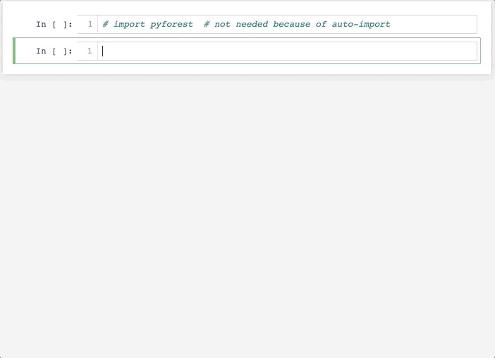

# Writing the same imports over and over again sucks. Let pyforest do the job for you.

pyforest lazy-imports all popular Python Data Science libraries so that they are always there when you need them. Once you use a package, pyforest imports it and even adds the import statement to your first Jupyter cell. If you don't use a library, it won't be imported. 

- [Demo in Jupyter Notebook](#demo-in-jupyter-notebook)
- [Using pyforest](#using-pyforest)
- [Installation](#installation)
- [FAQs](#frequently-asked-questions)
- [Contributing](#contributing)
- [Using pyforest as Package Developer](#using-pyforest-as-package-developer)
- [About](#about)
- [Join our community and grow further](#join-our-community-and-grow-further)


## Demo in Jupyter Notebook



## Using pyforest

After you [installed](#installation) pyforest and its Jupyter extension, you can __use your favorite Python Data Science commands like you normally would - just without writing imports__.

For example, if you want to read a CSV with pandas:

```python
df = pd.read_csv("titanic.csv")
```

pyforest will automatically import pandas for you and add the import statement to the first cell:
```python
import pandas as pd
```


__Which libraries are available?__
- We aim to add all popular Python Data Science libraries which should account for >99% of your daily imports. For example, we already added `pandas` as `pd`, `numpy` as `np`, `seaborn` as `sns`, `matplotlib.pyplot` as `plt`, or `OneHotEncoder` from `sklearn` and many more. In addition, there are also helper modules like `os`, `re`, `tqdm`, or `Path` from `pathlib`.
- You can see an overview of all currently available imports [here](src/pyforest/_imports.py)
- If you are missing an import, you can either __add the import to your user specific pyforest imports__ as described in the [FAQs](#frequently-asked-questions) or you can open a pull request for the official [pyforest imports](src/pyforest/_imports.py)

> In order to gather all the most important names, we need your help. Please open a pull request and add the [imports](src/pyforest/_imports.py) that we are still missing.


## Installation

> You need Python 3.6 or above because we love f-strings.

From the terminal (or Anaconda prompt in Windows), enter:

```bash
pip install --upgrade pyforest
python -m pyforest install_extensions
```

And you're ready to go.

Please note, that this will also add pyforest to your IPython default startup settings. If you do not want this, you can disable the auto_import as described in the [FAQs](#frequently-asked-questions) below.


## Frequently Asked Questions

- __"How to add my own import statements without adding them to the package source code?"__
    - pyforest creates a file in your home directory at `~/.pyforest/user_imports.py` in which you can type any **explicit** import statements you want (e.g. `import pandas as pd`). Your own custom imports take precedence over any other pyforest imports. **Please note:** implicit imports (e.g. `from pandas import *`) won't work.

- __"Doesn't this slow down my Jupyter or Python startup process?"__
    - No, because the libraries will only be imported when you actually use them. Until you use them, the variables like `pd` are only pyforest placeholders.

- __"Why can't I just use the typical IPython import?"__
    - If you were to add all the libraries that pyforest includes, your startup time might take more than 30s.

- __"I don't have and don't need tensorflow. What will happen when I use pyforest?"__
    - Tensorflow is included in pyforest but pyforest does not install any dependencies. You need to install your libraries separately from pyforest. Afterwards, you can access the libraries via pyforest if they are included in the [pyforest imports](src/pyforest/_imports.py).

- __"Will the pyforest variables interfere with my own local variables?"__
    - No, never. pyforest will never mask or overwrite any of your local variables. You can use your variables like you would without pyforest. The worst thing that can happen is that you overwrite a pyforest placeholder and thus cannot use the placeholder any more (duh).

- __"What about auto-completion on lazily imported modules?"__
    - It works :) As soon as you start the auto-completion, pyforest will import the module and return the available symbols to your auto-completer.

- __"How to (temporarily) deactivate the auto_import in IPython and Jupyter?"__
    - Go to the directory `~/.ipython/profile_default/startup` and adjust or delete the `pyforest_autoimport.py` file. You will find further instructions in the file. If you don't use the auto_import, you will need to import pyforest at the beginning of your notebook via `import pyforest`

- __"How to (re)activate the pyforest auto_import?"__
    - Execute the following Python command in Jupyter, IPython or Python: `from pyforest.auto_import import setup; setup()`. Please note that the auto_import only works for Jupyter and IPython.

- __"Can I use pyforest outside of the Jupyter Notebook or Lab?"__
    - Technically, yes. However, this is not the intended use case. pyforest is aimed primarily for the use in a Jupyter Notebook or Lab. If you want to use pyforest in IPython or a Python script etc, please import it as follows `import pyforest`. Afterwards, you can get the currently active imports via `pyforest.active_imports()`

- __"Why is the project called pyforest?"__
    - pyforest is created to be the home for all Data Science packages - including pandas. And in which ecosystems do pandas live? :)


## Contributing
In order to gather all the most important names, we need your help. Please open a pull request and add the imports that we are still missing to the [pyforest imports](src/pyforest/_imports.py). You can also find the guidelines in the [pyforest imports file](src/pyforest/_imports.py)


## Using pyforest as Package Developer
pyforest helps you to minimize the (initial) import time of your package which improves the user experience. If you want your package imports to become lazy, rewrite your imports as follows:

Replace

```python
import pandas as pd
```

with

```python
from pyforest import LazyImport
pd = LazyImport("import pandas as pd")
```


## About
pyforest is developed by [8080 Labs](https://8080labs.com). Our goal is to improve the productivity of Python Data Scientists. If you like the speedup to your workflow, you might also be interested in our other project [bamboolib](https://bamboolib.com)


## Join our community and grow further
If you
- like our work or
- want to become a faster Python Data Scientist or
- want to discuss the future of the Python Data Science ecosystem or
- are just interested in mingling with like-minded fellows

then, you are invited to [join our slack](https://join.slack.com/t/fasterpyds/shared_invite/enQtNzYxMTMzMDQ4MDk3LTYyNGRiNTE0OGJkNDEzZGRjNjg2Y2I0YWRlNTlmOGUxMjY5MDY5Yjg1MjliM2QwNmNhZmI3N2MxMmY3MGNiODA).
